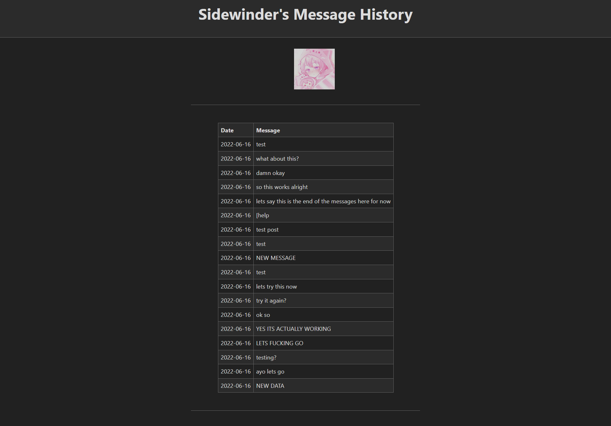

# Message History Bot
    

Tracks the message history of users on my discord server and saves it to a backend server which can then present a nice frontend with that users message history

[I will link the site here](https://message-history-bot.herokuapp.com/) but to see any actual message history, you'll need to [invite the bot](https://discord.com/api/oauth2/authorize?client_id=987047543399653447&permissions=0&scope=bot%20applications.commands) to a server and it will start tracking your messages

Table of Contents
- [Installation](#installation)
- [Usage](#usage)
- [Tech Stack](#tech-stack)
- [Credits](#credits)

## Installation
```
npm i
pip install -r requirements.txt
```

## Usage

[You could easily add this to your own server](https://discord.com/api/oauth2/authorize?client_id=987047543399653447&permissions=0&scope=bot%20applications.commands) and it the messages will appear on the backend. It doesn't sort by server however, so it's just a raw history

## Tech Stack
- Python (for the discord bot)
- Express (for the backend framework)
- NodeJS
- [SimpleCSS](https://simplecss.org/) (for the styling)

## Credits
- Author: Garrett Lee

---

## Demo

